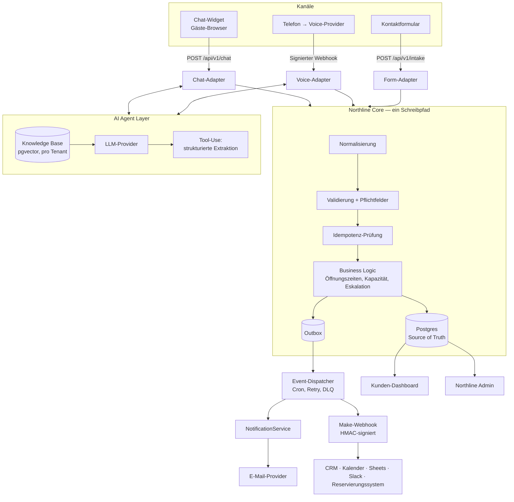

# Northline OS — Architektur-Audit

**Stand:** 2026-09-05
**Auftrag:** Abschnitt 27 des Northline-OS-Master-Prompts (A–I)
**Auditierte Codebase:** `Taylan444/claude-for-legal` @ `4a6c651`
**Ergebnis in einem Satz:** Der Audit der bestehenden Northline-Komponenten ist
**blockiert** — in dieser Session ist kein Northline-Code erreichbar. Was ohne
Codebase seriös erstellbar ist (Zielarchitektur, Datenmodell, Backlog), steht
unten; was ohne Codebase nur geraten wäre, ist ausdrücklich als *nicht bewertbar*
markiert statt erfunden.

---

## Nachtrag (2026-09-06) — Abschnitt A ist beantwortet

Rückmeldung auf den Audit: **Es existiert noch nichts.**

Damit entfällt der Audit des Bestandes ersatzlos. Die Abschnitte A, B und D
bleiben als Beleg der durchgeführten Prüfung stehen; Abschnitt F ist ab jetzt
kein Zielbild mehr, sondern der Bauplan. Abschnitt G (Migration) reduziert sich
auf einen Neubau: Phase 1 entfällt als „daneben stellen", die Phasen 2, 3 und 5
entfallen vollständig, weil es nichts gibt, wovon abgelöst werden müsste.

**Gebaut ist inzwischen:** [`core/`](./core/README.md) — der einzige
Schreibpfad, Postgres-Schema mit Row-Level-Security, Regelwerk, Outbox-
Dispatcher, Kanal-Adapter, zentrale Benachrichtigungsschicht und signierte
ausgehende Webhooks. 78 Tests, alle grün, ohne Laufzeitabhängigkeiten. Was noch
fehlt, steht ungeschönt in [`core/README.md`](./core/README.md) unter „Was noch
fehlt" — allen voran der Postgres-Adapter und die HTTP-Schicht.

---

## 0. Warum dieser Bericht anders aussieht als beauftragt

Abschnitt 27 verlangt: *„Führe zunächst einen vollständigen Architektur-Audit des
vorhandenen Projekts durch."* Genau das war der erste Arbeitsschritt. Der Befund:

Das Repository, in dem diese Session läuft, ist ein **Claude-Code-Plugin-
Marketplace für Rechtsanwendungen** (13 Plugins, 5 Managed-Agent-Cookbooks). Es
enthält keine Zeile Northline-OS-Code.

Belege aus der Inspektion:

| Prüfung | Ergebnis |
|---|---|
| Dateitypen im Repo | 221 × `.md`, 42 × `.json`, 30 × `.yaml`, 3 × `.py`, 2 × `.sh` |
| `package.json`, `next.config.*`, `vercel.json`, `tsconfig.json` | **0 Treffer** |
| `*.ts`, `*.tsx`, `*.jsx` | **0 Treffer** |
| `Dockerfile`, `requirements.txt`, `*.sql`, `.env*` | **0 Treffer** |
| Volltextsuche `northline`, `vapi`, `resend`, `vercel` | **0 Treffer** |
| Volltextsuche `restaurant`, `reservierung` | nur Falsch-Treffer aus juristischer Prosa (`reservation of rights`, `make`) |
| Marketplace-Manifest | `commercial-legal`, `privacy-legal`, `litigation-legal`, … — 13 Legal-Plugins |

Zusätzlich geprüft: die **GitHub-Repositories, auf die diese Session Zugriff
hat**. Es sind acht, keines davon ist Northline OS:

`claude-for-legal` (Fork), `Notebook-LM` (privat), `make-skills`,
`marketingskills`, `taste-skill`, `financial-services-plugins`,
`gemini-notebook-mcp-cli`, `social-media-skills`.

Die Website, der Chatbot, das Vercel-Projekt, die Resend- und Vapi-Anbindung aus
Abschnitt 26 existieren also entweder in einem Repository außerhalb dieses
GitHub-Kontos, direkt in der Vercel-/v0-Oberfläche ohne Git-Anbindung, oder noch
gar nicht.

**Konsequenz, gemäß Abschnitt 25 (Keine Scheinlösungen):** Die Audit-Abschnitte,
die zwingend die reale Codebase brauchen — A (Current State), B (Architecture
Map), D (Technical Debt), E (konkrete Security-Findings) — werden hier **nicht
mit Vermutungen gefüllt**. Ein erfundener Ist-Zustand wäre schlimmer als keiner:
er würde die Migrationsplanung auf Fantasie aufbauen.

Die Abschnitte, die aus dem Master-Prompt selbst und aus fachlichen Anforderungen
ableitbar sind — C (Gaps), F (Zielarchitektur), G (Migrationsstrategie),
H (Backlog), I (Next Action) — sind vollständig ausgearbeitet und ab Tag 1
nutzbar.

---

## A. CURRENT STATE — **nicht bewertbar**

Für Northline OS liegt kein einziges Artefakt vor. Nicht bewertbar sind damit:
bestehende Architektur, Frameworks, Vercel-Konfiguration, APIs, Routes,
Datenmodelle, Chatbot, Website, Resend-Integration, Authentifizierung,
Umgebungsvariablen, Webhooks, Datenbank, Automationen, Logging, Fehlerbehandlung,
Security, Deployment.

**Was ich zum Auflösen brauche** (eines davon genügt für den Start):

1. Git-Repository-URL des Northline-Projekts — dann `add_repo` und der Audit
   läuft in derselben Session weiter.
2. Falls das Projekt nur in Vercel/v0 ohne Git existiert: Export oder
   Git-Anbindung des Vercel-Projekts.
3. Falls unter einem anderen GitHub-Konto: Zugriff für dieses Konto freigeben.
4. Falls noch nichts existiert: explizite Bestätigung — dann ist Abschnitt F
   nicht Zielbild, sondern direkt Bauplan, und der Audit entfällt ersatzlos.

Ergänzend hilfreich, weil nicht im Code sichtbar: Liste der aktiven
Make-Szenarien, Vapi-Assistant-Konfiguration, Resend-Domain-/Absender-Setup,
sowie ob bereits eine Datenbank existiert (und welche).

---

## B. ARCHITECTURE MAP — **nicht bewertbar**

Kann erst nach A gezeichnet werden. Die *Ziel*-Map steht in Abschnitt F.

Eine ehrliche Vorbemerkung zum Erwartungsmanagement: Wenn die heutige Lösung so
aussieht, wie solche Piloten typischerweise entstehen — Chat-Widget ruft direkt
einen Make-Webhook, Vapi ruft ein zweites Make-Szenario, Resend wird aus beiden
heraus separat angestoßen — dann ist die Kernaussage des Audits absehbar: es gibt
zwei parallele Business-Logiken und keine gemeinsame Datenhaltung. Das ist
**eine Hypothese, kein Befund.** Sie wird erst durch Abschnitt A bestätigt oder
widerlegt und darf bis dahin keine Entscheidung tragen.

---

## C. GAPS — Chat → Backend → Restaurant / Voice → Backend → Restaurant

Diese Lücken sind unabhängig vom Ist-Zustand benennbar, weil sie sich aus der
Zielanforderung ergeben: *beide Kanäle, dieselbe Business Logic.*

| # | Lücke | Warum sie den Piloten blockiert |
|---|---|---|
| C1 | **Kein gemeinsamer Schreibpfad.** Chat und Voice müssen durch dieselbe Funktion laufen, nicht durch zwei ähnliche. | Ohne das driften die Kanäle inhaltlich auseinander: unterschiedliche Pflichtfelder, unterschiedliche Bestätigungsmails, unterschiedliche Fehlerfälle. Jede Änderung muss doppelt gebaut und doppelt getestet werden. |
| C2 | **Kein persistenter Speicher als Source of Truth.** Solange die Anfrage nur als E-Mail und als Make-Execution existiert, gibt es keinen Zustand, nur Nachrichten. | Die Frage „Die Reservierung von gestern Abend ist verschwunden" (Abschnitt 19) ist dann nicht beantwortbar. Das Dashboard (Abschnitt 13) ist ohne Datenbank nicht baubar. |
| C3 | **Keine Idempotenz auf dem Voice-Webhook.** Vapi liefert bei Timeout erneut aus. | Doppelte Reservierungen und doppelte Gast-E-Mails — im Restaurantbetrieb sofort sichtbar und peinlich. |
| C4 | **Kein Outbox-/Retry-Mechanismus.** Fällt Resend oder Make im Moment der Anfrage aus, ist die Anfrage weg. | Verstößt direkt gegen Abschnitt 21 („Keine stille Datenvernichtung"). Das ist der schwerwiegendste Fehlerfall des ganzen Systems: Der Gast glaubt, er hat reserviert. |
| C5 | **Keine strukturierte Extraktion mit Pflichtfeld-Logik.** Der Agent muss fehlende Angaben *aktiv nachfragen*, nicht Lücken lassen. | Eine Reservierung ohne Telefonnummer ist für das Restaurant wertlos. |
| C6 | **Keine mandantenfähige Konfiguration.** Öffnungszeiten, Kapazität, Absender, Sprache stecken sonst im Code. | Kunde #2 wird sonst zum Copy-Paste-Fork — der teuerste Fehler, den man in dieser Phase machen kann. |
| C7 | **Keine Knowledge-Trennung + Halluzinationsgrenze.** Der Agent braucht eine explizite „weiß ich nicht"-Antwort. | Ein Agent, der Öffnungszeiten oder Allergie-Informationen erfindet, ist ein Haftungsrisiko für den Kunden. |
| C8 | **Keine Eskalation an Menschen.** | Sonderfälle (große Gruppe, Beschwerde, Allergie) müssen zuverlässig bei einem Menschen landen. |
| C9 | **Keine Correlation-IDs über Kanalgrenzen.** | Support ohne durchgehende `request_id` ist Rätselraten über vier Anbieter-Dashboards hinweg. |
| C10 | **Kein Verarbeitungsverzeichnis.** DSGVO-Bewertung braucht eine Datengrundlage, die heute nicht existiert. | Blockiert die Arbeit mit Bestandskunden, sobald einer danach fragt — und Arztpraxen komplett. |

---

## D. TECHNICAL DEBT — **nicht bewertbar**

Erfordert die reale Codebase. Was ich stattdessen liefere, ist die **Prüfliste**,
die ich in Abschnitt A anlege, sobald der Zugriff steht — sortiert danach, was
bei Kunde #2 zuerst weh tut:

1. Hartkodierte Kundendaten (Name, Adresse, Öffnungszeiten, Telefonnummer,
   Menü, E-Mail-Empfänger) im Anwendungscode oder im System-Prompt.
2. Business-Logik in Make-Szenarien statt im Backend (Make als Gehirn statt als
   Integrations-Layer — Abschnitt 11).
3. Direkte `resend.send()`-Aufrufe verteilt über Route-Handler statt zentraler
   Notification-Schicht (Abschnitt 10).
4. Chat- und Voice-Pfad mit getrennter, divergierender Logik.
5. Secrets im Repository oder im Client-Bundle (`NEXT_PUBLIC_*` mit
   API-Schlüsseln — der klassische und teuerste Fehler).
6. Fehlende Eingabevalidierung an Webhook-Endpunkten.
7. `console.log` statt strukturiertem Logging; keine Request-IDs.
8. Kein Schema-Zwang auf LLM-Ausgaben (Freitext-Parsing statt Tool-Use).

---

## E. SECURITY & PRIVACY

Konkrete Findings sind ohne Code nicht möglich. Zwei Dinge lassen sich trotzdem
jetzt festhalten, weil sie Architekturentscheidungen sind, keine Code-Details.

### E.1 Die Risiken, die bei diesem Systemtyp strukturell entstehen

| Risiko | Warum es hier besonders greift |
|---|---|
| **Ungeschützter Webhook-Endpunkt** | Ein öffentlicher `/api/…`-Endpunkt ohne Signaturprüfung erlaubt jedem, Reservierungen und damit E-Mails im Namen des Kunden auszulösen. |
| **Cross-Tenant-Leak** | Sobald zwei Kunden dieselbe Datenbank teilen, ist eine vergessene `tenant_id`-Bedingung ein Datenschutzvorfall. Deshalb steht in Abschnitt F Row-Level-Security, nicht Disziplin. |
| **Prompt Injection über Gästeeingaben** | Gasttext geht in den Kontext des Agents. Ohne Trennung von Anweisung und Daten kann ein Gast den Agent zu falschen Zusagen bewegen. |
| **Secrets im Client** | Chat-Widget läuft im Browser des Gastes. Jeder Schlüssel im Bundle ist öffentlich. |
| **Unbegrenzte Kosten durch Missbrauch** | Ein offener Chat-Endpunkt ohne Rate-Limit ist eine Rechnung, die jemand anderes schreibt. |
| **Voice-Aufzeichnungen** | Gesprächsaufzeichnungen und Transkripte sind personenbezogen; Aufzeichnung ohne Hinweis ist rechtlich heikel. Aufzeichnung sollte per Tenant abschaltbar sein — Default: aus. |

### E.2 Datenschutz: was ich liefere und was ich ausdrücklich nicht behaupte

Gemäß Abschnitt 16 behaupte ich **nicht**, dass irgendetwas DSGVO-konform ist.
Ich liefere die Grundlage, auf der eine rechtliche Bewertung erfolgen kann: ein
Verarbeitungsverzeichnis-Gerüst, das mit dem tatsächlichen Setup gefüllt werden
muss.

| Datenkategorie | Zweck | Speicherort (zu bestimmen) | Beteiligte Anbieter | Aufbewahrung (Vorschlag) |
|---|---|---|---|---|
| Name, Telefon, E-Mail | Reservierung/Termin durchführen | Primärdatenbank | Hosting, DB | 12 Monate, dann Löschung |
| Chatverlauf | Anfrage verstehen, Support, Qualität | Primärdatenbank | Hosting, DB, LLM-Anbieter | 90 Tage im Klartext, danach anonymisierte Metriken |
| Voice-Transkript | wie Chat | Primärdatenbank + Voice-Anbieter | Voice-Anbieter, LLM-Anbieter | 90 Tage |
| Voice-Audioaufnahme | Qualitätssicherung | Voice-Anbieter | Voice-Anbieter | **Default: nicht aufzeichnen** |
| Sonderwünsche / Allergien | Leistungserbringung | Primärdatenbank | Hosting, DB | mit Reservierung |
| IP-Adresse | Missbrauchsabwehr, Rate-Limit | Logs | Hosting | 7 Tage |
| E-Mail-Zustellstatus | Nachweis der Benachrichtigung | E-Mail-Anbieter + eigene Delivery-Tabelle | E-Mail-Anbieter | 90 Tage |

**Offene Punkte, die vor dem Livegang geklärt sein müssen — juristische Prüfung
erforderlich, nicht durch mich entscheidbar:**

- AV-Verträge (Art. 28 DSGVO) mit **jedem** eingesetzten Anbieter: Hosting,
  Datenbank, LLM, Voice, E-Mail, Automation.
- Drittlandtransfer: Für jeden Anbieter ist zu prüfen und zu dokumentieren, ob
  Verarbeitung in der EU möglich ist und ob sie tatsächlich konfiguriert wurde.
  Bei US-Anbietern: Rechtsgrundlage des Transfers dokumentieren. **Das ist zu
  verifizieren, nicht aus dem Gedächtnis anzunehmen** — Regionen- und
  Zertifizierungsstatus ändern sich.
- Aufbewahrungsfristen mit dem Kunden abstimmen und **technisch erzwingen**
  (automatischer Löschjob), nicht nur dokumentieren.
- Informationspflicht: Hinweis auf KI-Einsatz und Datenverarbeitung im Chat-
  Widget und zu Beginn des Telefonats.
- Auskunfts- und Löschersuchen (Art. 15/17): Es braucht einen technischen Weg,
  alle Daten einer Person tenant-übergreifend zu finden und zu löschen. Das ist
  eine Datenmodell-Anforderung — deshalb steht sie in Abschnitt F, nicht im
  Nachgang.

> ### ⚠️ Arztpraxen — gesonderte Behandlung, für v1 gesperrt
>
> Terminanfragen bei Arztpraxen können Gesundheitsdaten nach Art. 9 DSGVO
> enthalten — schon ein Behandlungsgrund im Freitextfeld genügt. Diese Branche
> darf **nicht** über denselben Pfad wie Restaurants live gehen. Erforderlich
> sind mindestens: gesonderte Rechtsprüfung, ggf. Verzicht auf LLM-Verarbeitung
> von Freitext, strengere Löschfristen, restriktivere Anbieterauswahl und
> Prüfung der ärztlichen Schweigepflicht (§ 203 StGB), die über die DSGVO
> hinausgeht. **Empfehlung: Arztpraxen aus der Roadmap bis Client #3+
> herausnehmen und vorher juristisch bewerten lassen.** Bis dahin sollte das
> System diese Branche technisch nicht anbieten.

---

## F. TARGET ARCHITECTURE — Northline OS v1

### F.0 Leitentscheidung

> **Es gibt genau einen Schreibpfad.** Jeder Kanal — Chat, Voice, Formular, was
> auch immer als Nächstes kommt — endet in derselben Funktion
> `handleInboundRequest()`. Kanäle unterscheiden sich ausschließlich im Adapter
> davor, niemals in der Logik dahinter.

Das ist die eine Entscheidung, aus der fast alles andere folgt. Sie beantwortet
C1 direkt und macht Abschnitt 26 („beide Wege, dieselbe Business Logic")
strukturell wahr statt bloß beabsichtigt.

### F.1 Zielbild



### F.2 Stack-Empfehlung

Bewertet nach den drei North-Star-Fragen aus Abschnitt 28 und der
Kostenschranke aus Abschnitt 22.

| Baustein | Empfehlung | Begründung |
|---|---|---|
| **Runtime** | Next.js (App Router), ein Deployment für alle Tenants | Ein Deployment pro Kunde skaliert weder betrieblich noch wirtschaftlich. Tenant-Auflösung über Domain/`client_id`. |
| **Datenbank** | **Postgres, EU-Region (Frankfurt)** — Supabase oder Neon | Die eine Entscheidung, die den größten Hebel hat. Löst C2 und macht Dashboard, Support und Löschkonzept überhaupt erst möglich. Supabase bringt Postgres + pgvector + Storage in einem Produkt und spart in v1 zwei Anbieter. |
| **Vector Store** | **pgvector in derselben Datenbank** | Kein separater Vector-DB-Anbieter. Bei realistisch einigen hundert bis tausend Chunks pro Kunde ist eine dedizierte Vektordatenbank reine Zusatzkosten und ein zusätzlicher Auftragsverarbeiter. Abschnitt 7 verlangt genau diese Zurückhaltung. |
| **Asynchronität** | **Outbox-Tabelle + Cron-Dispatcher** | Kein Kafka, kein SQS, keine Queue-Infrastruktur. Eine Tabelle mit `attempts`/`next_retry_at` und ein Minuten-Cron erfüllen Abschnitt 21 vollständig und kosten nichts. |
| **LLM** | Claude — leistungsfähiges Modell für den Dialog, kleines schnelles Modell für Klassifikation/Extraktion | Zweistufig, weil Intent-Erkennung und Feld-Extraktion den Großteil der Aufrufe ausmachen und dort das günstige Modell genügt. Das ist der wirksamste Kostenhebel im System. |
| **E-Mail** | Bestehender Provider, hinter `NotificationService` | Abschnitt 10. Die Abstraktion ist hier *keine* Overengineering-Abstraktion: sie trägt Mandantenfähigkeit, Templates und Zustellprotokollierung. |
| **Voice** | Bestehender Provider, hinter `VoiceAdapter` | Der Adapter übersetzt Provider-Payload → Unified Request. Provider-Wechsel bedeutet dann eine Datei, nicht ein Projekt. |
| **Automation** | Make, ausschließlich als Konsument von Outbound-Events | Abschnitt 11. Make erhält Events, Make trifft keine Entscheidungen. |

**Bewusst *nicht* in v1:** Message Queue, Microservices, separater Vector-DB-
Anbieter, eigener Auth-Provider für Gäste, Kubernetes, Feature-Flag-Dienst,
mehrere Provider-Implementierungen pro Abstraktion. Jedes davon ist bei einem
einzigen Piloten Kostenstelle statt Nutzen — Abschnitt 17 verlangt ausdrücklich,
Abstraktionen erst zu bauen, wenn sie sich rechnen.

### F.3 Datenmodell

Grundregel: **Jede Zeile jeder fachlichen Tabelle trägt `tenant_id`, und
Row-Level-Security erzwingt die Trennung in der Datenbank.** Mandantentrennung
darf nicht davon abhängen, dass niemand ein `WHERE` vergisst (siehe E.1).

```sql
-- Mandant
tenants(
  id uuid pk, slug text unique, name text, industry text,
  timezone text, default_locale text, status text,      -- active | paused
  created_at timestamptz
)

-- Konfiguration statt Code (Abschnitt 4) — versioniert, damit revidierbar
tenant_configs(
  tenant_id uuid, version int, config jsonb,
  published_at timestamptz, published_by text,
  pk (tenant_id, version)
)

-- Gespräche über alle Kanäle
conversations(
  id uuid pk, tenant_id uuid, channel text,             -- chat | voice | form
  external_id text,                                     -- z.B. Call-ID des Voice-Providers
  locale text, status text,                             -- active | completed | escalated
  started_at timestamptz, ended_at timestamptz,
  unique (tenant_id, channel, external_id)
)

messages(
  id uuid pk, conversation_id uuid, tenant_id uuid,
  role text, content text,
  model text, tokens_in int, tokens_out int, latency_ms int,  -- Abschnitt 19 + 22
  created_at timestamptz
)

-- Das einheitliche Anfrage-Objekt (Abschnitt 5)
requests(
  id uuid pk, tenant_id uuid, conversation_id uuid,
  channel text, type text,                              -- reservation | appointment | lead | question
  status text,                                          -- new | needs_info | confirmed | escalated | cancelled
  customer_name text, customer_phone text, customer_email text,
  requested_at timestamptz,                             -- Wunschtermin, normalisiert in UTC
  party_size int,
  details jsonb,                                        -- branchenspezifische Erweiterung
  confidence numeric, raw_input jsonb,
  created_at timestamptz, updated_at timestamptz
)

-- Kein stiller Datenverlust (Abschnitt 21)
outbox(
  id uuid pk, tenant_id uuid, type text, payload jsonb,
  created_at timestamptz, delivered_at timestamptz,
  attempts int default 0, next_retry_at timestamptz, last_error text,
  dead_lettered_at timestamptz
)

deliveries(                                             -- Zustellnachweis je Kanal
  id uuid pk, tenant_id uuid, outbox_id uuid,
  target text, provider_message_id text,
  status text, error text, created_at timestamptz
)

-- Doppelte Webhooks (Abschnitt 9)
idempotency_keys(
  key text pk, tenant_id uuid, request_hash text,
  response jsonb, created_at timestamptz
)

-- Knowledge Base, strikt pro Tenant (Abschnitt 7)
kb_documents(
  id uuid pk, tenant_id uuid, source_type text, source_uri text,
  title text, version int, ingested_at timestamptz, active bool
)
kb_chunks(
  id uuid pk, tenant_id uuid, document_id uuid,
  content text, embedding vector(1536), metadata jsonb
)

audit_log(
  id uuid pk, tenant_id uuid, actor text, action text,
  entity_type text, entity_id uuid, diff jsonb, created_at timestamptz
)
```

**Warum `requests` Kernfelder als Spalten und den Rest als `jsonb` führt:** Was
das Dashboard filtert und sortiert (Datum, Status, Personenzahl, Kontakt), muss
indizierbar sein. Was je Branche variiert (Allergien beim Restaurant,
Behandlungsart bei Beauty, Aufenthaltszeitraum beim Hotel), gehört in `details` —
sonst wächst die Tabelle mit jeder neuen Branche um Spalten, die 90 % der Zeilen
leer lassen. Das ist die Umsetzung von „Core-Modell mit branchenspezifischen
Erweiterungen" aus Abschnitt 5.

**Löschkonzept ist Datenmodell-Anforderung, nicht Nachgedanke:** Ein Auskunfts-
oder Löschersuchen muss über `customer_phone` / `customer_email` innerhalb eines
Tenants alle `requests`, `conversations` und `messages` finden können. Deshalb
sind diese Felder indiziert und die Beziehungen durchgängig — nachträglich ist
das teuer.

### F.4 Unified Request — das Schema

Erzeugt vom Agent per Tool-Use (erzwungenes Schema), nicht durch Parsen von
Freitext. Das ist der Unterschied zwischen „funktioniert meistens" und
„funktioniert".

```jsonc
{
  "request_id":      "uuid",
  "client_id":       "uuid",
  "conversation_id": "uuid",
  "source":          "chat | voice | form",
  "intent":          "reservation | appointment | lead | question | complaint",
  "status":          "new | needs_info | confirmed | escalated | cancelled",
  "created_at":      "ISO-8601 UTC",

  "customer": { "name": "string|null", "phone": "E.164|null", "email": "string|null" },

  "request": {
    "date":       "YYYY-MM-DD|null",
    "time":       "HH:mm|null",
    "party_size": "int|null",
    "service":    "string|null",
    "message":    "string|null",
    "details":    { }        // branchenspezifisch, siehe unten
  },

  "metadata": {
    "language":   "de | en | …",
    "channel":    "string",
    "confidence": 0.0,        // < Schwellwert ⇒ Rückfrage statt Annahme
    "raw_input":  { }         // immer mitgespeichert, für Support (Abschnitt 19)
  }
}
```

Branchenspezifische `details`:

| Branche | `intent` | `details` |
|---|---|---|
| Restaurant | `reservation` | `dietary_notes[]`, `occasion`, `seating_preference`, `high_chair` |
| Hotel | `reservation` | `check_in`, `check_out`, `adults`, `children`, `room_type` |
| Beauty | `appointment` | `treatment`, `duration_min`, `preferred_staff` |
| Golf / Tennis | `appointment` | `court_or_tee`, `players`, `membership_status`, `coach` |
| Arztpraxis | `appointment` | ⚠️ **gesperrt** — Art.-9-Prüfung ausstehend, siehe E.2 |

**Pflichtfeld-Regel je Tenant konfigurierbar** (`tenant_configs`). Fehlt ein
Pflichtfeld, ist der Status `needs_info` und der Agent fragt nach — statt eine
unbrauchbare Anfrage zu speichern (C5).

### F.5 Events

```
lead.created                    reservation.requested
appointment.requested           conversation.completed
escalation.requested            request.status_changed
notification.failed
```

Jedes Event wird **innerhalb derselben Transaktion** wie die fachliche Änderung
in `outbox` geschrieben. Damit gibt es keinen Zustand, in dem eine Reservierung
gespeichert ist, das Event aber verloren ging — der eigentliche Kern von
Abschnitt 21.

Der Dispatcher läuft als Minuten-Cron, holt fällige Zeilen, stellt zu und
markiert. Retry mit exponentiellem Backoff, nach 5 Versuchen `dead_lettered_at`
plus interne Alarmierung. Ausgehende Webhooks werden HMAC-signiert und tragen
`X-Northline-Event-Id`, damit Make seinerseits deduplizieren kann.

### F.6 API-Oberfläche

| Endpunkt | Zweck | Schutz |
|---|---|---|
| `POST /api/v1/chat` | Chat-Turn, Antwort des Agents | Origin-Prüfung gegen Tenant-Domain, Rate-Limit pro IP+Tenant, kein Schlüssel im Client |
| `POST /api/v1/intake` | Formular / interne Erfassung | API-Key pro Tenant, serverseitig |
| `POST /api/v1/webhooks/voice/:provider` | Voice-Ereignisse | Signaturprüfung, Idempotenz, sofort 200 + asynchrone Verarbeitung |
| `GET /api/v1/requests` | Dashboard | Session-Auth, RLS |
| `POST /api/internal/dispatch` | Cron-Ziel | Cron-Secret |

**Voice-Webhook — die vier Regeln, die C3 lösen:**
1. Signatur prüfen, **bevor** der Body geparst wird.
2. Rohpayload sofort speichern — vor jeder Verarbeitung. Was gespeichert ist,
   kann nicht stillschweigend verschwinden.
3. Idempotenzschlüssel `{provider}:{call_id}:{event_type}`; bei Wiederholung die
   gespeicherte Antwort zurückgeben, nicht erneut verarbeiten.
4. Innerhalb weniger Sekunden mit 200 antworten; die eigentliche Arbeit
   übernimmt die Outbox. Ein langsamer Handler produziert Timeouts und damit
   genau die Doppelzustellungen, gegen die Regel 3 schützt.

### F.7 Agent Layer

- **Systemprompt aus `tenant_configs` gerendert**, nicht pro Kunde geschrieben.
- **Knowledge ausschließlich per Retrieval** aus `kb_chunks` mit
  `WHERE tenant_id = …`. Kein globaler Index über alle Kunden.
- **Halluzinationsgrenze (C7):** Findet das Retrieval nichts Passendes, ist die
  einzig zulässige Antwort ein explizites „Das weiß ich nicht — ich leite die
  Frage weiter." Das gehört in den Prompt *und* in die Testfälle aus Abschnitt 20.
- **Quellenangabe** intern mitgeführt (`chunk_id`), damit im Support
  nachvollziehbar ist, worauf eine Antwort beruht.
- **Gasttext ist Daten, nie Anweisung** — klar abgegrenzt im Kontext (E.1).
- **Eskalation** als Werkzeug des Agents, das `escalation.requested` auslöst.

### F.8 Kostenrahmen

Abschnitt 22 verlangt, dass die Architektur wirtschaftlich trägt. Die
Größenordnungen:

- **Fix, über alle Tenants geteilt:** Hosting + Datenbank. Das ist der Grund für
  ein einziges Deployment und eine geteilte Datenbank — beides skaliert mit der
  Kundenzahl kaum mit.
- **Variabel, dominiert von Voice:** Telefonieminuten sind um Größenordnungen
  teurer als Chat-Tokens. Ein Kunde mit hohem Anrufaufkommen ist der einzige
  realistische Weg in die Verlustzone.
- **Zweiter Hebel: Modellwahl.** Extraktion und Klassifikation auf dem kleinen
  Modell, Dialog auf dem großen.

> **Nicht aus dem Gedächtnis kalkulieren.** Konkrete Preise pro Minute und pro
> Million Tokens ändern sich; sie sind vor der Preisgestaltung gegen die
> aktuellen Preislisten zu prüfen. Deshalb steht in `messages` die
> Token-Erfassung und in `deliveries` der Zustellstatus: **Kosten pro Tenant
> müssen gemessen werden, nicht geschätzt.** Ohne diese Messung ist die
> Deckungsbeitragsfrage nicht beantwortbar — und sie ist die wichtigste Frage
> des Geschäftsmodells.

---

## G. MIGRATION PLAN

Grundsatz aus Abschnitt 3: **Extend, not rewrite.** Der Plan ist deshalb so
gebaut, dass der Pilot durchgehend funktionsfähig bleibt und jeder Schritt für
sich abbrechbar ist.

**Phase 0 — Audit nachholen (blockiert, siehe A).**
Zugriff auf die Codebase, Inventar erstellen, Abschnitte A/B/D/E füllen. Erst
danach ist entscheidbar, welche der folgenden Phasen entfallen, weil das
Bestehende bereits trägt.

**Phase 1 — Datenbank daneben stellen, nichts abschalten.**
Postgres in EU-Region aufsetzen, Schema anlegen, den Pilotkunden als ersten
Tenant eintragen. Bestehende Abläufe laufen unverändert weiter. Risiko minimal,
weil rein additiv.

**Phase 2 — Mitschreiben statt Umschalten.**
Die bestehenden Pfade schreiben *zusätzlich* in `requests`. Der bisherige Weg zur
Benachrichtigung bleibt aktiv. Nach ein bis zwei Wochen ist belegt, dass die
Datenbank vollständig und korrekt befüllt wird — mit echtem Verkehr, nicht mit
Testdaten. Erst dieser Beleg rechtfertigt Phase 3.

**Phase 3 — Core übernimmt den Schreibpfad.**
`handleInboundRequest()` wird führend, Outbox und `NotificationService` gehen
live. Die alten Direktverbindungen werden **nach** nachgewiesener Parität
abgeschaltet, nicht davor.

**Phase 4 — Voice auf denselben Pfad ziehen.**
Voice-Adapter mit Signaturprüfung und Idempotenz. Ab hier ist die Aussage aus
Abschnitt 26 — beide Kanäle, dieselbe Logik — technisch wahr.

**Phase 5 — Make von der Logik zum Konsumenten.**
Szenarien nacheinander auf Outbound-Events umstellen. Jedes Szenario einzeln,
jedes einzeln verifiziert.

**Phase 6 — Konfiguration statt Code.**
Alles Kundenspezifische wandert nach `tenant_configs`. Prüfkriterium: Kunde #2
lässt sich anlegen, ohne eine Codezeile zu ändern. Das ist der Moment, in dem aus
einem Projekt ein Produkt wird.

Rollback: Bis einschließlich Phase 3 ist jederzeit auf den alten Pfad
zurückschaltbar, weil dieser bis zum Paritätsnachweis aktiv bleibt.

---

## H. PRIORITY BACKLOG

### P0 — blockiert Pilot / Produktion

| # | Aufgabe | Löst |
|---|---|---|
| P0-1 | **Zugriff auf die Northline-Codebase herstellen und Audit A/B/D/E abschließen** | blockiert alles Weitere |
| P0-2 | Postgres EU + Schema + RLS + Tenant #1 | C2, C6 |
| P0-3 | `handleInboundRequest()` als einziger Schreibpfad | C1 |
| P0-4 | Outbox + Cron-Dispatcher + Retry + Dead-Letter + Alarm | C4 |
| P0-5 | `NotificationService` mit mandantenfähigen Templates (Gast-Bestätigung, Betriebs-Benachrichtigung) | Abschnitt 10 |
| P0-6 | Voice-Adapter: Signaturprüfung, Rohpayload-Speicherung, Idempotenz | C3 |
| P0-7 | Strukturierte Extraktion per Tool-Use + Pflichtfeld-Rückfragen | C5 |
| P0-8 | Halluzinationsgrenze + Eskalationswerkzeug | C7, C8 |
| P0-9 | Secrets-Audit: kein Schlüssel im Client-Bundle, keiner im Repo | E.1 |
| P0-10 | Rate-Limiting auf allen öffentlichen Endpunkten | E.1, Kostenschutz |
| P0-11 | Strukturiertes Logging mit durchgehender `request_id` | C9, Abschnitt 19 |
| P0-12 | Testsuite über die 18 Szenarien aus Abschnitt 20 — Happy **und** Failure Paths | Abschnitt 20 |
| P0-13 | Verarbeitungsverzeichnis füllen, AV-Verträge sammeln, KI-Hinweis in Widget und Anruf | C10, E.2 |

### P1 — notwendig für Kunde #2

Tenant-Auflösung über Domain · `tenant_configs` vollständig (Öffnungszeiten,
Branding, Sprache, Absender, Pflichtfelder, Eskalationsregeln) · KB-Ingestion
(Website, PDF, Speisekarte) mit pgvector · Widget mit Branding aus der
Konfiguration · Admin-CRUD zum Anlegen von Kunden · Löschjob für
Aufbewahrungsfristen · Onboarding-Ablauf aus Abschnitt 15 als dokumentierte,
wiederholbare Checkliste.

### P2 — notwendig für Skalierung

Kunden-Dashboard (Abschnitt 13) · Kosten- und Nutzungsmessung pro Tenant
(Abschnitt 22) · Conversation-History-Ansicht · KB-Verwaltung durch den Kunden ·
Northline Admin (Abschnitt 14) · Alarmierung bei Anbieterausfällen ·
Provider-Abstraktionen **erst dort, wo ein zweiter Provider real ansteht**
(Abschnitt 17).

### P3 — später sinnvoll

Teilautomatisiertes Onboarding (Website-Import → KB → Grundkonfiguration) ·
Billing · Team-Verwaltung · A/B-Tests von Agent-Prompts · weitere Kanäle
(WhatsApp) · Self-Service-Onboarding · Arztpraxen **nur nach abgeschlossener
Rechtsprüfung**.

---

## I. NEXT ACTION

> ### Die eine Aufgabe, die jetzt ansteht
>
> **Zugriff auf die Northline-Codebase herstellen — oder bestätigen, dass noch
> keine existiert.**

Das ist keine Ausweich-Antwort, sondern die einzig verantwortbare. Jede
Bau-Aufgabe, die ich stattdessen nennen könnte, hätte eine erhebliche
Wahrscheinlichkeit, etwas zu bauen, das bereits existiert — und würde damit genau
gegen Abschnitt 3 verstoßen.

Konkret genügt einer dieser Schritte (Details in Abschnitt A):
Repository-URL nennen · Vercel-Projekt an Git anbinden · Zugriff für dieses
GitHub-Konto freigeben · oder bestätigen: „Es existiert noch nichts."

**Die erste Bau-Aufgabe unmittelbar danach** — unabhängig davon, wie der Audit
ausfällt, weil sie in jedem Szenario gebraucht wird:

> **P0-2 + P0-3: Postgres in EU-Region mit Schema und RLS aufsetzen und
> `handleInboundRequest()` als einzigen Schreibpfad implementieren, zunächst im
> Mitschreib-Modus neben dem bestehenden Ablauf (Phase 1–2).**

Damit entstehen in einem Schritt: die fehlende Source of Truth (C2), der
gemeinsame Pfad für Chat und Voice (C1) und die Grundlage für Dashboard, Support
und Löschkonzept. Additiv, ohne Risiko für den laufenden Piloten.

---

## Was funktioniert, was fehlt, warum — und was als Nächstes kommt

Gemäß Abschnitt 25, ohne Beschönigung:

**Was funktioniert:** Dieses Dokument. Zielarchitektur, Datenmodell,
Event-Modell, Migrationsstrategie, Backlog und Datenschutz-Gerüst sind
ausgearbeitet und ab sofort als Bauplan verwendbar.

**Was fehlt:** Der Audit des Bestehenden — Abschnitte A, B, D und die konkreten
Security-Findings in E.

**Warum es fehlt:** In dieser Session ist kein Northline-Code erreichbar — weder
im Arbeitsverzeichnis noch in einem der acht zugänglichen GitHub-Repositories.
Belege in Abschnitt 0.

**Was der nächste konkrete Schritt ist:** Abschnitt I.

**Wovor ich ausdrücklich warne:** Auf Basis dieses Dokuments jetzt mit dem Bauen
zu beginnen, ohne den Ist-Zustand zu kennen, wäre genau der Fehler, den
Abschnitt 3 verbietet. Die Zielarchitektur ist als *Ziel* belastbar. Ob der Weg
dorthin bei Phase 1 oder erst bei Phase 4 beginnt, entscheidet der Audit — nicht
dieses Dokument.
